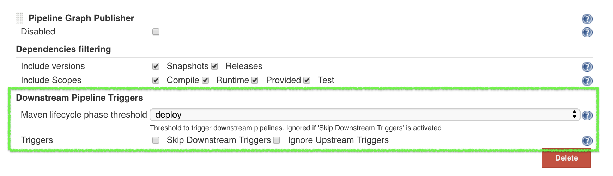
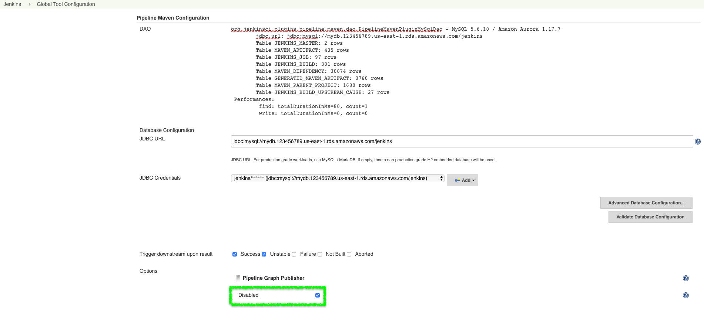

[[pipeline-maven-plugin-faq]]
= Pipeline Maven Plugin FAQ
:toc: macro
:toc-title:
ifdef::env-github[]
:tip-caption: :bulb:
:note-caption: :information_source:
:important-caption: :heavy_exclamation_mark:
:caution-caption: :fire:
:warning-caption: :warning:
endif::[]

Frequently Asked Questions about the Pipeline Maven Plugin

toc::[]

== How to use the Pipeline Maven Plugin with Docker?

NOTE: Since version 3.0.3

Since the version 1.14 of the Docker Pipeline plugin, `withMaven` requires to

* Either prepend the `MVN_CMD_DIR` environment variable to the `PATH` environment variable in every `sh` step that invokes `mvn` (e.g. `sh 'export PATH=$MVN_CMD_DIR:$PATH && mvn clean deploy`).
* Or use Takari's Maven Wrapper (e.g. `sh './mvnw clean deploy'`)

If omitted, the Maven settings file and Mven global settings file will not be injected in the Maven execution.

=== Using `withMaven` with `docker.image(...).inside{...}` and a Jenkins Scripted Pipeline

**Prepending MVN_CMD_DIR to PATH**

[source,groovy]
----
node("linux-agent-running-docker") { // Linux agent with the Docker daemon
    docker.image('maven').inside { // Docker image with Maven installed
        withMaven() {
            git "https://github.com/cyrille-leclerc/my-jar.git"
            sh "export PATH=$MVN_CMD_DIR:$PATH && mvn clean deploy" // 'mvn' command: need to add the $MVN_CMD_DIR to $PATH
        }
    }
}
----

**Using Takari's Maven Wrapper mvnw**

[source,groovy]
----
node("linux-agent-running-docker") { // Linux agent with the Docker daemon
    docker.image('openjdk:8-jdk').inside { // Docker image with Java installed
        withMaven() {
            git "https://github.com/cyrille-leclerc/my-jar.git"
            sh "./mvnw clean deploy" // 'mvnw' command (e.g. "./mvnw deploy")
        }
    }
}
----

=== Using `withMaven` with `docker.image(...).inside{...}` to a Jenkins Declarative Pipeline

NOTE: TODO: provide a sample with Jenkins Declarative Pipeline

=== Sample message displayed in the build logs when using withMaven in a Docker Pipeline execution environment

The warning message displayed in the logs when invoking `withMaven` within Docker Pipeline:

----
 [withMaven] WARNING: "withMaven(){...}" step running within "docker.image('image').inside {...}". Since the Docker Pipeline Plugin version 1.14, you MUST:
 [withMaven] * Either prepend the 'MVN_CMD_DIR' environment variable to the 'PATH' environment variable in every 'sh' step that invokes 'mvn' (e.g. "sh 'export PATH=$MVN_CMD_DIR:$PATH && mvn clean deploy' ").
 [withMaven] * Or use Takari's Maven Wrapper (e.g. "sh './mvnw clean deploy'")
 [withMaven] See Pipeline Maven Plugin FAQ.
----

== How to disable the Maven Event Spy injected by the Pipeline Maven Plugin in Maven builds?

It may be convenient to temporarily disable the Maven Event Spy of the Jenkins Pipeline Maven plugin, for example for troubleshooting purpose.

You can disable the Maven Event Spy of the Jenkins Pipeline Maven plugin (making it no-op) doing one of the following:

* Setting the environment variable `JENKINS_MAVEN_AGENT_DISABLED` to `true` in the job execution
[source,groovy]
----
withMaven() {
   sh """
export JENKINS_MAVEN_AGENT_DISABLED=true
mvn package
"""
}
----
or using `withEnv`
[source,groovy]
----
withEnv(['JENKINS_MAVEN_AGENT_DISABLED=true']) {
   sh "mvn package"
}
----

* Adding the system property `-Dorg.jenkinsci.plugins.pipeline.maven.eventspy.JenkinsMavenEventSpy.disabled=true` to the invocation of the mvn build

== Why do I see messages `[WARNING] Picked up JAVA_TOOL_OPTIONS...` in the build logs?

The Jenkins Pipeline Maven Plugin uses the `JAVA_TOOL_OPTIONS` environment variable to pass options to subsequent Maven builds such as the actual release build when invoking `mvn release:prepare release:perform`.
The plugin passes the properties `-Dmaven.ext.class.path` and `-Dorg.jenkinsci.plugins.pipeline.maven.reportsFolder`.

When using the `JAVA_TOOL_OPTIONS`, the JVM outputs a message during its initialization.

With the Jenkins Pipeline Maven Plugin, this message looks like:

----
 [WARNING] Picked up JAVA_TOOL_OPTIONS: -Dmaven.ext.class.path="/path/to/workspace/...@tmp/withMaven.../pipeline-maven-spy.jar" -Dorg.jenkinsci.plugins.pipeline.maven.reportsFolder="/path/to/workspace/...@tmp"
----

NOTE: It is not possible to disable this warning message.

== My downstream pipelines don't get triggered even if I use "Build whenever a SNAPSHOT dependency is built"!

A common reason why downstream pipelines don't get triggered when using "Build whenever a SNAPSHOT dependency is built" is that the upstream pipeline is using "mvn install" when the Jenkins Pipeline Maven integration is configured to trigger pipelines on "mvn deploy".

To configure the Jenkins Pipeline Maven integration to trigger downstream pipelines on "mvn install":

* Either change the default configuration:
** Navigate to "Manage Jenkins / Global Tools Configuration"
** Click on "Add Publisher" and select "Pipeline Graph Publisher"
** In the section "Downstream Pipeline Triggers", change the "Maven lifecycle threshold" from "deploy" to "install"

* Or in the script of the upstream pipeline, configure

[source,groovy]
----
withMaven(options: [pipelineGraphPublisher(lifecycleThreshold: 'install')]) {
/* sh/bat ...*/
}
----

== How can I troubleshoot problems of trigger of downstream pipelines?

* The Pipeline Maven Plugin uses the Jenkins log levels (see https://www.jenkins.io/doc/book/system-administration/viewing-logs/#logs-in-jenkins[here]) to output additional troubleshooting information in the pipeline build logs (the "Console Output" menu of the build).
* To output additional troubleshooting information about the  trigger of downstream pipelines, enable in "Manage Jenkins / System Log" (docs https://www.jenkins.io/doc/book/system-administration/viewing-logs/#logs-in-jenkins[here]) the following loggers at a level FINE or FINER or more:
** `org.jenkinsci.plugins.pipeline.maven.publishers.PipelineGraphPublisher`
** `org.jenkinsci.plugins.pipeline.maven.listeners.DownstreamPipelineTriggerRunListener`
* Re run the pipeline that is supposed to trigger downstream pipelines.
* Look at the pipeline build logs ("Console Output" menu), ensure that the build is completed and that the following message is displayed in the logs:
----
[withMaven] downstreamPipelineTriggerRunListener - completed in XXX ms
----
Troubleshooting details are added

== How do I capture the log file generated by the Jenkins Maven Event Spy?

You can archive the XML log file generated by the Jenkins Maven Event Spy creating the marker file `.archive-jenkins-maven-event-spy-logs`.

.Sample
[source,groovy]
----
withMaven() {
    sh "mvn package"
    writeFile file: '.archive-jenkins-maven-event-spy-logs', text: ''
} // will discover the marker file ".archive-jenkins-maven-event-spy-log" and will archive the maven event spy log file maven-spy-....log
----

== How do I check the Maven settings in use by my build?

You can dump the effective Maven settings of your pipeline using the Maven Help plugin and the http://maven.apache.org/plugins/maven-help-plugin/effective-settings-mojo.html[help:effective-settings] goal

[source,groovy]
----
withMaven(){
   mvn help:effective-settings
}
----

== How can I reduce the footprint of the database of the Jenkins Pipeline Maven Plugin?

The Jenkins pipeline Maven plugin uses a database to trigger downstream pipelines when a snapshot is built.

For production grade deployments, a MySQL database is needed instead of the embedded H2 database. My SQL 5.6+, Amazon Aurora MySQL and MariaDB 10.2+ have been successfully tested.

To reduce the usage of the database, disable the `Pipeline Graph Publisher` navigating to `Manage Jenkins / Global Tool Configuration / Pipeline Maven Configuration then clicking on `Add Publisher Options`, selecting `Pipeline Graph Publisher` and checking the `disabled` checkbox.

== Why do I see messages [withMaven] One or multiple Maven executions have been ignored..."` in the build logs?

The message
----
[withMaven] One or multiple Maven executions have been ignored by the Jenkins Pipeline Maven Plugin because they have been interrupted before completion...
----
is displayed because one or several Maven execution (e.g. `mvn deploy`) have been interrupted before they could gracefully complete.

The event `org.apache.maven.eventspy.EventSpy#close()` has not been invoked on the Maven event spies.

This interruption usually happens because the mvn process has been killed by the Operating System, typically for memory constraints in Docker or cgroups environments. Another cause is a `kill -9` during the build.

== Why do I see messages `javax.xml.parsers.FactoryConfigurationError: Provider for class javax.xml.parsers.DocumentBuilderFactory cannot be created` ?

This error is caused by the installation of another plugin that pulls an outdated version of Apache Xerces. That pulls a version of Apache Xerces that is not compatible with the version of the JVM. Typically, Xerces 2.6 will not be compatible with a JDK 8 due to changes in the JAXP API (sample: https://issues.jenkins-ci.org/browse/JENKINS-47486[JENKINS-47486]).

The solution is to get this plugin updated so that it uses a more recent of Xerces that would be compatible with the JDK.

To identify the plugin that is pulling an outdated version of a JAXP implementation (typically Xerces), navigate to the Jenkins Script Console (`Manage Jenkins` then `Script Console`) and execute the following groovy script:

[source,groovy]
----
String className = "org.apache.xerces.jaxp.DocumentBuilderFactoryImpl"

Class klass
try {
  klass = Class.forName(className)
} catch (Exception e) {
  println("Exception trying to load " + className + " from the system classloader, try the thread context classloader " + e)
  // contextClassLoader should not work but let's try it.
  klass = Class.forName(className, false, Thread.currentThread().getContextClassLoader())
}

java.security.CodeSource codeSource = klass.getProtectionDomain().getCodeSource()

if (codeSource == null) {
  println(klass.toString() + " -> source not found")
} else {
  println(klass.toString() + " -> " + codeSource.getLocation());
}
----

The output message will show from which plugin the XercesParser is loaded. Sample with a plugin "my_plugin" that would load an outdated 2.6.2 version of Xerces:

 class org.apache.xerces.jaxp.DocumentBuilderFactoryImpl -> file:/var/lib/jenkins/plugins/my_plugin/WEB-INF/lib/xercesImpl-2.6.2.jar

== How to use Maven build data in generated emails?

It is possible to use information generated by Maven pipelines in emails generated by the https://plugins.jenkins.io/email-ext/[Jenkins Email Ext Plugin].

See https://groups.google.com/forum/#!topic/jenkinsci-users/sPAYLh1W1cM

.Sample Pipeline code to expose artifact details in emails
[source,groovy]
----
env.DEPLOYEDARTIFACTS = getDeployedArtifacts()

@NonCPS
def getDeployedArtifacts() {
    def deployed = ''
    Collection<org.jenkinsci.plugins.pipeline.maven.MavenArtifact> generatedArtifacts = currentBuild.rawBuild.getAction(org.jenkinsci.plugins.pipeline.maven.publishers.MavenReport.class).getGeneratedArtifacts();
    for (org.jenkinsci.plugins.pipeline.maven.MavenArtifact generatedArtifact:generatedArtifacts) {
        if (generatedArtifact.isDeployed()) {

            deployed= deployed.concat(generatedArtifact.getUrl())
            deployed = deployed.concat("===")
            deployed = deployed.concat(generatedArtifact.getShortDescription())
            deployed = deployed.concat(",")
        }

    }
    return deployed
}
----

In EXT-MAIL-STANDARD-TEMPLATE

.Sample mail template using Maven build details
[source,html]
----
     
    <!-- MAVEN ARTIFACTS -->
    <j:set var="mbuilds" value="${it.getAction('org.jenkinsci.plugins.workflow.cps.EnvActionImpl').getOverriddenEnvironment()}" />
        <h5>Deployed Artifacts</h5>
         <j:set var="generatedArtifacts" value="${mbuilds.get('DEPLOYEDArtifacts')}" />

       <table width="100%" style="font-family: Verdana, Helvetica, sans serif; font-size: 11px; color: black">
        <j:forEach var="artifacts" items="${generatedArtifacts.split(',')}" >
        <j:set var="artifact" value="${artifacts.split('===')}" />
         <tr bgcolor="white" >
          <td class="bg1" colspan="2" style="font-family: Verdana, Helvetica, sans serif; font-size: 120%; color: black">
          <li>
            <a href="${artifact[0]}">
            ${artifact[1]}
          </a>
          </li>
           </td>
         </tr>
         </j:forEach>
       </table>
  
----
