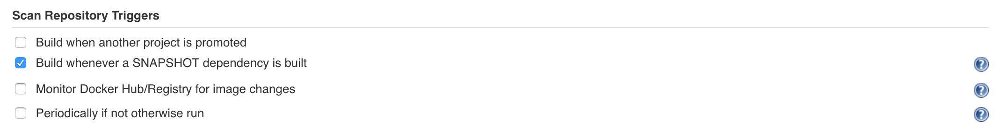
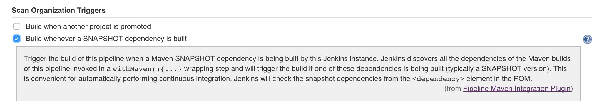

= Pipeline Maven Plugin

This plugin provides maven integration with Pipeline through the `withMaven` step. Configures maven environment to use within a pipeline job by calling `sh mvn` or `bat mvn`.

The selected maven installation will be configured and prepended to the path.

See the https://wiki.jenkins-ci.org/display/JENKINS/Pipeline+Maven+Plugin[Plugin Wiki] for release
information and documentation.

Older versions of this plugin may not be safe to use. Please review the
following warnings before using an older version:

* https://jenkins.io/security/advisory/2017-03-09/[Arbitrary files from Jenkins master available in Pipeline by using
the withMaven
step]
* https://jenkins.io/security/advisory/2019-05-31/#SECURITY-1409[XML External Entity processing
vulnerability]
* https://jenkins.io/security/advisory/2020-08-12/#SECURITY-1794%20(2)[CSRF vulnerability and missing permission check allow capturing
credentials]
* https://jenkins.io/security/advisory/2020-08-12/#SECURITY-1794%20(1)[Missing permission check allows enumerating credentials
IDs]

== Usage

An example pipeline script using the pipeline Maven plugin:

*Maven build on a Linux agent*

[source,syntaxhighlighter-pre]
----
node{
  stage ('Build') {

    git url: 'https://github.com/cyrille-leclerc/multi-module-maven-project'

    withMaven(
        // Maven installation declared in the Jenkins "Global Tool Configuration"
        maven: 'maven-3',
        // Maven settings.xml file defined with the Jenkins Config File Provider Plugin
        // We recommend to define Maven settings.xml globally at the folder level using
        // navigating to the folder configuration in the section "Pipeline Maven Configuration / Override global Maven configuration"
        // or globally to the entire master navigating to  "Manage Jenkins / Global Tools Configuration"
        mavenSettingsConfig: 'my-maven-settings') {

      // Run the maven build
      sh "mvn clean verify"

    } // withMaven will discover the generated Maven artifacts, JUnit Surefire & FailSafe & FindBugs & SpotBugs reports...
  }
}
----

Within a node or a docker.image block, create a withMaven block to setup
a with maven environment. The configured environment will be used when
calling maven inside the block by using `sh mvn` or `bat mvn`. The
following parameters can be used to configure maven:

* *Maven* (`maven`): Allow the selection of a Maven installation
configured on the Global Jenkins configuration or on the Global Tool
Configuration page if using Jenkins > 2.0. When auto-install is
enabled, maven will be downloaded and made available for the
pipeline job.
* *JDK* (`jdk`): Allows the selection of a JDK installation. If
auto-install is enabled, the JDK will be downloaded and made
available for the pipeline job.
* *Maven Settings*
 ** *Maven Settings Config* (`mavenSettingsConfig`): Select a
Maven settings file *ID* from https://github.com/jenkinsci/config-file-provider-plugin[Config File Provider Plugin]
allowing the replacement of server credentials and variable
substitutions as configured in https://github.com/jenkinsci/config-file-provider-plugin[Config File Provider Plugin].
The settings element in the `settings.xml` file contains
elements used to define values which configure Maven execution
in various ways, like the `pom.xml`, but should not be bundled
to any specific project, or distributed to an audience. See also
http://maven.apache.org/settings.html[settings.xml] reference
* {blank}
 ** *Maven Settings File Path* (`mavenSettingsFilePath`): Specify
the path to a Maven `settings.xml` file on the build agent. The
specified path can be absolute or relative to the workspace.
 ** If none of "mavenSettingsConfig" and "mavenSettingsFilePath" are
defined, "withMaven(){}" will use the Maven settings defined in
the Jenkins Global Tool Configuration if declared
* **Maven Global Settings +
**
 ** *Maven Global Settings Config* (`globalMavenSettingsConfig`):
Select a Maven global settings file *ID* from https://github.com/jenkinsci/config-file-provider-plugin[Config File Provider Plugin].
 ** *Maven Global Settings File Path*
(`globalMavenSettingsFilePath`): Specify the path to a Maven
global `settings.xml` file on the build agent. The specified
path can be absolute or relative to the workspace.
 ** If none of "globalMavenSettingsConfig" and
"globalMavenSettingsFilePath" are defined, "withMaven(){}" will
use the Maven global settings defined in the Jenkins Global Tool
Configuration if declared
* *Maven JVM Opts* (`mavenOpts`): Specify JVM specific options
needed when launching Maven as an external process, these are not
maven specific options. See: https://docs.oracle.com/javase/8/docs/technotes/tools/windows/java.html#CBBIJCHG[Java Options] +
Shell-like environment variable expansions work in this field, by
using the `${VARIABLE`} syntax.
* *Maven Local Repository* (`mavenLocalRepo`): Specify a custom
local repository path. Shell-like environment variable expansions
work with this field, by using the `${VARIABLE`} syntax. Normally,
Jenkins uses the local Maven repository as determined by Maven, by
default `~/.m2/repository` and can be overridden by
`<localRepository>` in `~/.m2/settings.xml` (see Configuring your
Local Repository)) +
This normally means that all the jobs that are executed on the same
node shares a single Maven repository. The upside of this is that
you can save the disk space, the downside is that the repository is
not multi process safe and having multiple builds run concurrently
can corrupt it. Additionally builds could interfere with each other
by sharing incorrect or partially built artifacts. For example, you
might end up having builds incorrectly succeed, just because your
have all the dependencies in your local repository, despite that
fact that none of the repositories in POM might have them. +
By using this option, Jenkins will tell Maven to use a custom path
for the build as the local Maven repository by using
`-Dmaven.repo.local` +
If specified as a relative path then this value will be resolved
against the workspace root and not the current working directory. +
ie. `$WORKSPACE/.repository` if `.repository` value is specified.

image:docs/images/information.svg[(info)]
`mavenSettingsConfig` and `globalMavenSettingsConfig` use the *ID*,
not the *name*, of the Maven settings file (resp Maven Global Settings
file).

_The Pipeline Syntax snippet code generator can be used to assist on
generating the withMaven step parameters_

In the above example the following parameters are use to configure
maven:

* *maven:* 'M3' Maven Installation will be used, this installation
has to be declared in the Global Jenkins configuration or Tool
installations page.
* *mavenLocalRepo:* a local repository folder is specified to avoid
shared repositories
* *mavenSettingsConfig:* specifies an specific settings.xml
configuration from https://github.com/jenkinsci/config-file-provider-plugin[Config File Provider Plugin],
allowing the replacement of variables and credentials.

== Features

=== Sensible default Maven parameters

The Maven parameters that are useful on a build server, "[.code]``--batch-mode``"
("[.code]``-B``") and "[.code]``--show-version``" ("[.code]``-V``") are enable by default, no need
to add them in your mvn invocations.

=== Maven Settings Support

The "``withMaven()"`` pipeline step will setup the Maven settings file and
global settings file either explicitly using the attributes of the
"withMaven(){}" step declaration or implicitly using the Maven Global
Settings and Settings files defined at the folder level or in the
Jenkins Global Tools Configuration.

Using implicit declaration, Jenkins administrators can simplify the work
of pipeline authors hiding the "boilerplate" to declare the credentials
of the Git, Nexus, Artifactory... servers and all the needed proxies,
mirrors...

image:docs/images/global-tools-configuration-maven-settings.png[]
image:docs/images/default-maven-settings-defined-at-the-folder-level.png[]

=== Traceability of Maven builds

The "``withMaven()"`` pipeline step will capture in the logs of the build
all the details of the execution:

* Version of the JVM
 ** `"withMaven(){}"` step initialization:
"[.code]``[withMaven] use JDK installation JDK8``"
 ** `"mvn"` executable invocation:
"[.code]``Java version: 1.8.0_102, vendor: Oracle Corporation``""
* Version of Maven
 ** `"withMaven(){}"` step initialization:
"[.code]``[withMaven] use Maven installation 'M3'``""
 ** `"mvn"` executable invocation:
"[.code]``Apache Maven 3.3.9 (bb52d8502b132ec0a5a3f4c09453c07478323dc5; 2015-11-10T16:41:47+00:00)``""
* Name or path of the Maven settings.xml and Maven global settings.xml
file.
 ** `"withMaven(){}"` step initialization:
"[.code]``[withMaven] use Maven settings provided by the Jenkins Managed Configuration File 'maven-settings-for-supply-chain-build-job'``"
* When using the Maven settings.xml and global settings.xml files
provided by the https://github.com/jenkinsci/config-file-provider-plugin[Jenkins Config File Provider Plugin], +
details of the Jenkins credentials injected in the Maven build.
 ** `"withMaven(){}"` step initialization:
"``+[withMaven] use Maven settings.xml 'maven-settings-for-supply-chain-build-job' with Maven servers credentials provided by Jenkins (replaceAll: true): [mavenServerId: 'nexus.beescloud.com', jenkinsCredentials: 'beescloud-nexus-deployment-credentials', username: 'deployment', ...]+``"

Sample:

 [withMaven] use JDK installation JDK8
 [withMaven] use Maven installation 'M3'
 [withMaven] use Maven settings provided by the Jenkins Managed Configuration File 'maven-settings-for-supply-chain-build-job'
 [withMaven] use Maven settings.xml 'maven-settings-for-supply-chain-build-job' with Maven servers credentials provided by Jenkins (replaceAll: true):
      [mavenServerId: 'nexus.beescloud.com', jenkinsCredentials: 'beescloud-nexus-deployment-credentials', username: 'deployment', type: 'UsernamePasswordCredentialsImpl'],
      [mavenServerId: 'github.beescloud.com', jenkinsCredentials: 'github-enterprise-api-token', username: 'dev1', type: 'UsernamePasswordCredentialsImpl']
 ...
 Running shell script
 + mvn clean deploy
 ----- withMaven Wrapper script -----
 Picked up JAVA_TOOL_OPTIONS: -Dmaven.ext.class.path=".../pipeline-maven-spy.jar" -Dorg.jenkinsci.plugins.pipeline.maven.reportsFolder="..."
 Apache Maven 3.3.9 (bb52d8502b132ec0a5a3f4c09453c07478323dc5; 2015-11-10T16:41:47+00:00)
 Maven home: /home/ubuntu/jenkins-home/tools/hudson.tasks.Maven_MavenInstallation/M3
 Java version: 1.8.0_102, vendor: Oracle Corporation
 Java home: /home/ubuntu/jenkins-home/tools/hudson.model.JDK/JDK8/jre
 Default locale: en_US, platform encoding: UTF-8
 OS name: "linux", version: "3.13.0-109-generic", arch: "amd64", family: "unix"

=== Report Publishers

Maven build executions inside the "``+withMaven(){...+``}" will be detected
and Jenkins will transparently

* Archive and fingerprint generated Maven artifacts and Maven attached
artifacts
* Publish JUnit / Surefire reports (if the https://github.com/jenkinsci/junit-plugin[Jenkins JUnit
Plugin] is
installed)
* image:https://wiki.jenkins.io/s/en_GB/8100/5084f018d64a97dc638ca9a178856f851ea353ff/_/images/icons/emoticons/warning.svg[(warning)] Deprecation notice! Publish Findbugs reports (if the https://github.com/jenkinsci/findbugs-plugin[Jenkins FindBugs
Plugin]
is installed)
* image:https://wiki.jenkins.io/s/en_GB/8100/5084f018d64a97dc638ca9a178856f851ea353ff/_/images/icons/emoticons/warning.svg[(warning)] Deprecation notice! Publish a report of the tasks ("[.code]``FIXME``" and "[.code]``TODO``") found in the
java source code (if the https://wiki.jenkins-ci.org/display/JENKINS/Task+Scanner+Plugin[Jenkins Tasks Scanner
Plugin]
is installed)
* Concordion test reports (since 3.0.0)

image:docs/images/information.svg[(info)]
The detection of Maven builds require to use Maven 3.2+.

. Jenkins Plugin to publish the reports on the Jenkins build page. If
the plugin is not installed, then the MAven report is ignored.
. Download https://repo.jenkins-ci.org/releases/org/jenkins-ci/plugins/pipeline-maven/2.3.0-beta-1/pipeline-maven-2.3.0-beta-1.hpi[pipeline-maven-2.3.0-beta-1.hpi]
.  Marker file to temporarily disable the feature for a specific Maven
build. +
Typically used to disable a reporter for a specific build that would
generate too much data for the default configuration of the reporter
(e.g. too many generated artifacts...) or to workaround a bug in the
"[.code]``withMaven``" waiting for a fix. These marker file must be located in
the home directory of the build.

==== Implicit or Explicit activation of Publishers

By default, all the publishers are enabled by default.

It is possible to change the default activation of a publisher
navigating to the "Global Tool Configuration" screen.

It is possible to disable the default activation of publishers on a
specific "``+withMaven(){...}+``" step using the
"[.code]``publisherStrategy='EXPLICIT'``" attribute in the step
"``+withMaven(publisherStrategy='EXPLICIT'){...}+``". The publishers can
then be enabled explicitly in the "``+withMaven(){...}+``" step using the
"publishers" attribute

=== Default Configuration

Default Maven settings can be defined globally and at the folder level.

==== Global Default Configuration

In the "Global Tool Configuration" screen

* Maven settings and Maven global settings
* Publishers settings: enable/disable publishers...

image::docs/images/pipeline-maven-plugin-global-tools-configuration.png[]

==== Folder Level Configuration

In the Folder "configuration" screen

* Maven settings and Maven global settings

image:docs/images/pipeline-maven-folder-level-configuration.png[]

=== Trigger downstream pipeline when a snapshot is built (since 3.0.0)

Trigger downstream pipeline that depend on Maven artifact generated by
upstream pipelines.

image:docs/images/information.svg[(info)] Notes

* The upstream artifact must be generated in a "[.code]``withMaven(){}``"
wrapping step to be detected by the triggering system
* The downstream pipeline must have selected the build trigger "Build
whenever a SNAPSHOT dependency is built"
 ** The build trigger can be defined at the pipeline level ("Build
Triggers"), at the multibranch pipeline level ("Scan Repository
Triggers") or at the GitHub Organization / Bitbucket Project
level ("Scan Organizations Triggers")
* You have to manually trigger once the upstream pipeline and the
downstream pipeline so that the link between the pipelines based on
the SNAPSHOT dependency is established
* The dependency graph is, for the moment, exclusively stored in an H2
embedded database
("[.code]``$JENKINS_HOME/jenkins-jobs/jenkins-jobs.mv.db``"). Support for an
external H2 database and then for alternate databases (PostgreSQL)
is on the roadmap
(see https://github.com/jenkinsci/pipeline-maven-plugin/blob/pipeline-maven-3.0.0-beta-1/jenkins-plugin/src/main/java/org/jenkinsci/plugins/pipeline/maven/dao/PipelineMavenPluginH2Dao.java[PipelineMavenPluginH2Dao.java])

image:docs/images/image2017-8-7_12:38:11.png[]

* Thresholds are applied to define on which type of maven build the
downstream pipelines are triggered
 ** Threshold based on the status of the upstream pipeline
("success", "unstable", "failure", "no build", "aborted"). By
default, only builds with a "success" result will trigger
downstream builds.
  *** image:docs/images/downstream-pipeline-trigger-threshold-build-result.png[]
 ** Threshold based on the https://maven.apache.org/guides/introduction/introduction-to-the-lifecycle.html[Maven lifecycle
phase]
reached in the Maven build of the upstream job ("package",
"install", "deploy"). By default, only the maven builds who
reach the "deploy" phase will trigger downstream builds.
  *** image:docs/images/downstream-pipeline-trigger-threshold-lifecycle.png[]

=== Linux, Windows and MacOSX support

The Pipeline Maven Plugin works with Linux, Windows and MacOSX build
agents.

*Maven build on a Windows agent*

[source,syntaxhighlighter-pre]
----
node ("windows") {
  stage ('Build') {

    git url: 'https://github.com/cyrille-leclerc/multi-module-maven-project'

    withMaven(...) {

      bat "mvn clean install"

    } // withMaven will discover the generated Maven artifacts, JUnit Surefire & FailSafe reports and FindBugs reports
  }
}
----

=== Support of Takari's Maven Wrapper 'mvnw' (since 3.0.3)

The Pipeline Maven Plugin works with https://github.com/takari/maven-wrapper[Takari's Maven
wrapper] 'mvnw'.

[source,syntaxhighlighter-pre]
----
withMaven(...) {
   sh "./mvnw clean deploy"
}
...
----

== Adding more Maven Reporters

The API for Maven reporters is still experimental. Please open a Request
for Enhancement Jira issue to discuss how to add Maven reporters.

We want to quickly add reporters for CheckStyle, Jacoco...

== Setup

=== Using a MySQL Database (since 3.6.0)

The Jenkins Pipeline Maven Plugin relies on a database to store its data
(list of dependencies and of generated artifacts of each build...).

By default, the Jenkins Pipeline Maven Plugin uses an H2 embedded
database but it is recommend to use an external MySQL database.

Configuration steps to use a MySQL:

* Create an empty MySQL database with a dedicated MySQL user with
permissions for Data Manipulation Language actions (DML) and Data
Definition Language (DDL) actions
 ** Tested with MySQL 8.0, with MariaDB 10.2 and 10.3 and with
Amazon Aurora MySQL 5.6
* Install the Jenkins "MySQL Database" plugin
 ** Navigate to "Manage Jenkins / Manage Plugins / Available",
select the "MySQL Database" plugin and click on "Download now
and install after restart"
*  Configure the Pipeline Maven Plugin to use the created MySQL
database
 ** Create Jenkins credentials for the MySQL connection navigating
to "Credentials" on the left menu
 ** Navigate to "Manage Jenkins / Global Tools Configuration" and go
to the "Pipeline Maven Configuration"
 ** image:docs/images/pipeline-maven-plugin-configuration-1.png[]
 ** In the Database configuration section, define the following
  *** JDBC URL: url of the database, e.g.
"jdbc:mysql://mysql.example.com/jenkins"
  *** JDBC Credentials: select the credentials of the MySQL
database
  *** The https://github.com/brettwooldridge/HikariCP/wiki/MySQL-Configuration[parameters recommended by the Hikari Connection Pool
team]
are used by default for the MySQL connections and for the
datasource (max pool size:10, server side prepared
statements cache with 250 entries...).  To overwrite these
defaults, click on the "Advanced Database Convfiguration"
button.
 ** Click on "Validate Database Configuration" button to verify that
the connection is successful
 ** Click on "Save"
 ** image:docs/images/pipeline-maven-plugin-configuration-2.png[]

=== Using a PostgreSQL Database (since 3.7.0)

The Jenkins Pipeline Maven Plugin relies on a database to store its data
(list of dependencies and of generated artifacts of each build...).

By default, the Jenkins Pipeline Maven Plugin uses an H2 embedded
database but it is recommended to use an external PostgreSQL or MySQL /
MariaDB database.

Configuration steps to use a PostgreSQL:

* Create an empty PostgreSQL database with a dedicated PostgreSQL user
with permissions for Data Manipulation Language actions (DML) and
Data Definition Language (DDL) actions
 ** Tested with PostgreSQL 10.6 and 11.3
* Install the Jenkins the https://github.com/jenkinsci/postgresql-api-plugin[PostgreSQL
API]
plugin
 ** Navigate to "Manage Jenkins / Manage Plugins / Available",
select the "PostgreSQL API" plugin and click on "Download now
and install after restart"
*  Configure the Pipeline Maven Plugin to use the created PostgreSQL
database
 ** Create Jenkins credentials for the PostgreSQL connection
navigating to "Credentials" on the left menu
 ** Navigate to "Manage Jenkins / Global Tools Configuration" and go
to the "Pipeline Maven Configuration"
 ** image:docs/images/pipeline-maven-plugin-configuration-postgresql.png[]
 ** In the Database configuration section, define the following
  *** JDBC URL: url of the database, e.g.
"jdbc:postgresql://postgresql.example.com:5432/jenkins"
  *** JDBC Credentials: select the credentials of the PostgreSQL
database
  *** The underlying datasource,
https://github.com/brettwooldridge/HikariCP[HikariCP],
comes with sensible default configuration values (see
https://github.com/brettwooldridge/HikariCP#configuration-knobs-baby[here]).
To overwrite these defaults, click on the "Advanced Database
Configuration" button.
 ** Click on "Validate Database Configuration" button to verify that
the connection is successful
 ** Click on "Save"
 ** Navigate to "Manage Jenkins / Global Tools Configuration" and go
to the "Pipeline Maven Configuration" to verify that the
database connection is successful and the database tables have
been created (see screenshot above)

== Known Limitations

=== Maven and JDK installation not supported in `+docker.image('xxx').inside{...}+`

Maven and JDK installers do not work with
"``+docker.image('xxx').inside{...}+``" as the docker step does not allow
the use of Tool Installer, the preinstalled Maven and JDK on the docker
image will be auto-discovered and used.

=== `withMaven()` not supported in "``+docker.image('xxx').inside{...}"+`` with old versions of the Docker engine

`withMaven()` not supported in "``+docker.image('xxx').inside{...}+``" with
old versions of the Docker engine such as Docker 1.13.1 on CentOS7.

Any help to fix this bug is more than welcome.

https://issues.jenkins-ci.org/browse/JENKINS-40484[JENKINS-40484] -
Getting issue details... STATUS
