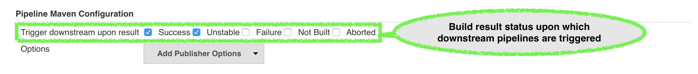
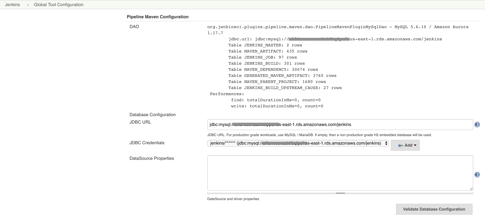

[[pipeline-maven-plugin]]
= Pipeline Maven Plugin
:toc: macro
:toc-title:
ifdef::env-github[]
:tip-caption: :bulb:
:note-caption: :information_source:
:important-caption: :heavy_exclamation_mark:
:caution-caption: :fire:
:warning-caption: :warning:
endif::[]

link:https://ci.jenkins.io/job/Plugins/job/pipeline-maven-plugin/job/master/[image:https://ci.jenkins.io/job/Plugins/job/pipeline-maven-plugin/job/master/badge/icon[Build]]
link:https://github.com/jenkinsci/pipeline-maven-plugin/graphs/contributors[image:https://img.shields.io/github/contributors/jenkinsci/pipeline-maven-plugin.svg?color=blue[Contributors]]
link:https://plugins.jenkins.io/pipeline-maven/[image:https://img.shields.io/jenkins/plugin/i/pipeline-maven.svg?color=blue&label=installations[Jenkins Plugin Installs]]
link:https://plugins.jenkins.io/pipeline-maven/[image:https://img.shields.io/jenkins/plugin/v/pipeline-maven.svg[Plugin]]
link:https://github.com/jenkinsci/pipeline-maven-plugin/releases/latest[image:https://img.shields.io/github/release/jenkinsci/pipeline-maven-plugin.svg?label=changelog[GitHub release]]

[.float-group]
--
[.text-center]


--

The Pipeline Maven Plugin provides an *advanced set of features* for using https://maven.apache.org[Apache Maven] in https://www.jenkins.io/doc/book/pipeline/[Jenkins Pipelines].

The `withMaven` step configures a maven environment to use within a pipeline job by calling `sh "mvn ...` or `bat "mvn ...`.
The selected maven installation is configured and prepended to the path.

It provides **several <<features>> to simplify** the creation of your Pipeline scripts and ensure the **<<feature-traceability>>**.

It uses some **<<feature-sensible-default-maven-settings>>** for a CI usage (batch-mode, ...) and **automatically configures the Jenkins <<feature-publishers>>** (Artifacts, JUnit, ...).

The **<<feature-default-configuration>> can be defined globally or at the folder level** to keep your pipeline code as short as possible while using the expected configuration (Maven settings.xml file...) globally or locally.

This plugin allows transitioning smoothly from the legacy https://plugins.jenkins.io/maven-plugin/[Maven Integration] job type by allowing to reuse **<<feature-maven-integration-global-settings>>** and by proposing the **<<feature-trigger-downstream>>**.

toc::[]

[#installation]
== Installation

The plugin can be found under the name `Pipeline Maven Integration Plugin` in the https://updates.jenkins.io/#default-update-site[Default Update Site].

**For tests purposes only**, pre-releases (beta) versions are available in the https://updates.jenkins.io/#experimental-plugin-site[Experimental Plugin Site] and development versions (incremental releases) are archived on every successful build on https://ci.jenkins.io/job/Plugins/job/pipeline-maven-plugin/[our CI environment].

CAUTION: **If you use the feature <<feature-trigger-downstream>> it is critical to <<db-setup,setup a real production database>>** instead of the default embedded H2 instance.
**If you don't do it, it might degrade your environment stability** (The H2 database is running in your instance JVM and could request too many resources).

[#changelog]
== Changelog

Release notes are recorded in https://github.com/jenkinsci/pipeline-maven-plugin/releases[GitHub Releases].

[#usage]
== Usage

The Pipeline Maven Plugin works with Linux, Windows and MacOSX build agents.

.Simple Maven build on a Linux agent.
[source,groovy]
----
node {
  stage ('Build') {
    git url: 'https://github.com/cyrille-leclerc/multi-module-maven-project'
    withMaven {
      sh "mvn clean verify"
    } // withMaven will discover the generated Maven artifacts, JUnit Surefire & FailSafe reports and FindBugs reports
  }
}
----

It can supports various parameters to fine-tune its behavior.

Within a node or a docker.image block, create a withMaven block to set up a `with maven` environment.

The configured environment will be used when calling maven inside the block by using `sh mvn` or `bat mvn`.

The following parameters can be used to configure Maven:

* *Maven* (`maven`): Allow the selection of a Maven installation configured on the Global Jenkins configuration or on the Global Tool Configuration page if using Jenkins > 2.0. When auto-install is enabled, maven will be downloaded and made available for the pipeline job.
* *JDK* (`jdk`): Allows the selection of a JDK installation.
If auto-install is enabled, the JDK will be downloaded and made available for the pipeline job.
* *Maven Settings*
** *Maven Settings Config* (`mavenSettingsConfig`): Select a
Maven settings file *ID* from https://plugins.jenkins.io/config-file-provider/[Config File Provider Plugin] allowing the replacement of server credentials and variable substitutions as configured in https://github.com/jenkinsci/config-file-provider-plugin[Config File Provider Plugin].
The settings' element in the `settings.xml` file contains elements used to define values which configure Maven execution in various ways, like the `pom.xml`, but should not be bundled to any specific project, or distributed to an audience. See also http://maven.apache.org/settings.html[settings.xml] reference
** *Maven Settings File Path* (`mavenSettingsFilePath`): Specify the path to a Maven `settings.xml` file on the build agent.
The specified path can be absolute or relative to the workspace.
** If none of `mavenSettingsConfig` and `mavenSettingsFilePath` are defined, `withMaven(){}` will use the Maven settings defined in the Jenkins Global Tool Configuration if declared
* **Maven Global Settings**
** *Maven Global Settings Config* (`globalMavenSettingsConfig`): Select a Maven global settings file *ID* from https://plugins.jenkins.io/config-file-provider/[Config File Provider Plugin].
** *Maven Global Settings File Path* (`globalMavenSettingsFilePath`): Specify the path to a Maven global `settings.xml` file on the build agent. The specified path can be absolute or relative to the workspace.
** If none of `globalMavenSettingsConfig` and`globalMavenSettingsFilePath` are defined, `withMaven(){}` will use the Maven global settings defined in the Jenkins Global Tool Configuration if declared
* *Maven JVM Opts* (`mavenOpts`): Specify JVM specific options needed when launching Maven as an external process, these are not maven specific options.
See: https://docs.oracle.com/javase/8/docs/technotes/tools/windows/java.html#CBBIJCHG[Java Options] +
Shell-like environment variable expansions work in this field, by using the `${VARIABLE`} syntax.
* *Maven Local Repository* (`mavenLocalRepo`): Specify a custom local repository path.
Shell-like environment variable expansions work with this field, by using the `${VARIABLE`} syntax.
Normally, Jenkins uses the local Maven repository as determined by Maven, by default `~/.m2/repository` and can be overridden by `<localRepository>` in `~/.m2/settings.xml` (see Configuring your Local Repository)) +
This normally means that all the jobs that are executed on the same node shares a single Maven repository.
The upside of this is that you can save the disk space, the downside is that the repository is not multi process safe and having multiple builds run concurrently can corrupt it.
Additionally, builds could interfere with each other by sharing incorrect or partially built artifacts.
For example, you might end up having builds incorrectly succeed, just because your have all the dependencies in your local repository, despite that fact that none of the repositories in POM might have them. +
By using this option, Jenkins will tell Maven to use a custom path for the build as the local Maven repository by using `-Dmaven.repo.local` +
If specified as a relative path then this value will be resolved against the workspace root and not the current working directory. +
ie. `$WORKSPACE/.repository` if `.repository` value is specified.
* *Maven Traceability* (`traceability`): adds additional output to the maven wrapper script. Maven is executed with parameter `--show-version` and the start of the wrapper script is indicated by `----- withMaven Wrapper script -----`. Defaults to `true`.

IMPORTANT: `mavenSettingsConfig` and `globalMavenSettingsConfig` use the *ID*, not the *name*, of the Maven settings file (resp Maven Global Settings file).

TIP: The Pipeline Syntax snippet code generator can be used to assist on generating the withMaven step parameters!

.More complex Maven build on a Windows agent.
[source,groovy]
----
node ("windows") {
  stage ('Build') {

    git url: 'https://github.com/cyrille-leclerc/multi-module-maven-project'

    withMaven(
        // Maven installation declared in the Jenkins "Global Tool Configuration"
        maven: 'maven-3', // <1>
        // Use `$WORKSPACE/.repository` for local repository folder to avoid shared repositories
        mavenLocalRepo: '.repository', // <2>
        // Maven settings.xml file defined with the Jenkins Config File Provider Plugin
        // We recommend to define Maven settings.xml globally at the folder level using
        // navigating to the folder configuration in the section "Pipeline Maven Configuration / Override global Maven configuration"
        // or globally to the entire master navigating to  "Manage Jenkins / Global Tools Configuration"
        mavenSettingsConfig: 'my-maven-settings' // <3>
    ) {

      // Run the maven build
      sh "mvn clean verify"

    } // withMaven will discover the generated Maven artifacts, JUnit Surefire & FailSafe & FindBugs & SpotBugs reports...
  }
}
----

In the above example the following parameters are used to configure Maven:

<1> *maven:* 'maven-3' Maven Installation will be used, this installation has to be declared in the Global Jenkins configuration or Tool installations page.
<2> *mavenLocalRepo:* a local repository folder is specified to avoid shared repositories
<3> *mavenSettingsConfig:* specifies a specific settings.xml configuration from https://plugins.jenkins.io/config-file-provider/[Config File Provider Plugin], allowing the replacement of variables and credentials.

[#features]
== Features

=== Configurable as code

See demos on the https://plugins.jenkins.io/configuration-as-code/[Configuration as Code]:

https://github.com/jenkinsci/configuration-as-code-plugin/tree/master/demos/pipeline-maven

[#feature-sensible-default-maven-settings]
=== Sensible default Maven parameters

The Maven parameters that are useful on a build server, `--batch-mode`(`-B`) and `--show-version` (`-V`) are enable by default, no need to add them in your mvn invocations.

[#feature-maven-integration-global-settings]
=== Maven Settings Support

Please note this is NOT part of this plugin, this is the https://plugins.jenkins.io/maven-plugin/[Maven] plugin configuration, but we depend on it.

The `withMaven()` pipeline step will setup the Maven settings file and global settings file either explicitly using the attributes of the `withMaven(){}` step declaration or implicitly using the Maven Global Settings and Settings files defined at the folder level or in the Jenkins Global Tools Configuration.

Using implicit declaration, Jenkins administrators can simplify the work of pipeline authors hiding the "boilerplate" to declare the credentials of the Git, Nexus, Artifactory... servers and all the needed proxies, mirrors...


image:docs/images/default-maven-settings-defined-at-the-folder-level.png[]

[#feature-traceability]
=== Traceability of Maven builds

The `withMaven()` pipeline step will capture in the logs of the build all the details of the execution:

* Version of the JVM
** `withMaven(){}` step initialization:
----
[withMaven] use JDK installation JDK8
----
** `mvn` executable invocation:
----
Java version: 1.8.0_102, vendor: Oracle Corporation
----
* Version of Maven
** `withMaven(){}` step initialization:
----
[withMaven] use Maven installation 'M3'
----
** `mvn` executable invocation:
----
Apache Maven 3.3.9 (bb52d8502b132ec0a5a3f4c09453c07478323dc5; 2015-11-10T16:41:47+00:00)
----
* Name or path of the Maven settings.xml and Maven global settings.xml file.
** `withMaven(){}` step initialization:
----
[withMaven] use Maven settings provided by the Jenkins Managed Configuration File 'maven-settings-for-supply-chain-build-job'
----
* When using the Maven settings.xml and global settings.xml files provided by the https://plugins.jenkins.io/config-file-provider/[Jenkins Config File Provider Plugin], details of the Jenkins credentials injected in the Maven build.
** `withMaven(){}` step initialization:
----
[withMaven] use Maven settings.xml 'maven-settings-for-supply-chain-build-job' with Maven servers credentials provided by Jenkins (replaceAll: true): [mavenServerId: 'nexus.beescloud.com', jenkinsCredentials: 'beescloud-nexus-deployment-credentials', username: 'deployment', ...]
----

.Sample
----
 [withMaven] use JDK installation JDK8
 [withMaven] use Maven installation 'M3'
 [withMaven] use Maven settings provided by the Jenkins Managed Configuration File 'maven-settings-for-supply-chain-build-job'
 [withMaven] use Maven settings.xml 'maven-settings-for-supply-chain-build-job' with Maven servers credentials provided by Jenkins (replaceAll: true):
      [mavenServerId: 'nexus.beescloud.com', jenkinsCredentials: 'beescloud-nexus-deployment-credentials', username: 'deployment', type: 'UsernamePasswordCredentialsImpl'],
      [mavenServerId: 'github.beescloud.com', jenkinsCredentials: 'github-enterprise-api-token', username: 'dev1', type: 'UsernamePasswordCredentialsImpl']
 ...
 Running shell script
 + mvn clean deploy
 ----- withMaven Wrapper script -----
 Picked up JAVA_TOOL_OPTIONS: -Dmaven.ext.class.path=".../pipeline-maven-spy.jar" -Dorg.jenkinsci.plugins.pipeline.maven.reportsFolder="..."
 Apache Maven 3.3.9 (bb52d8502b132ec0a5a3f4c09453c07478323dc5; 2015-11-10T16:41:47+00:00)
 Maven home: /home/ubuntu/jenkins-home/tools/hudson.tasks.Maven_MavenInstallation/M3
 Java version: 1.8.0_102, vendor: Oracle Corporation
 Java home: /home/ubuntu/jenkins-home/tools/hudson.model.JDK/JDK8/jre
 Default locale: en_US, platform encoding: UTF-8
 OS name: "linux", version: "3.13.0-109-generic", arch: "amd64", family: "unix"
----

[#feature-publishers]
=== Report Publishers

Maven build executions inside the `withMaven(){}` will be detected and Jenkins will transparently

* Archive and fingerprint generated Maven artifacts and Maven attached artifacts
* Publish JUnit / Surefire reports (if the https://plugins.jenkins.io/junit/[Jenkins JUnit Plugin] is installed)
* Concordion test reports (since 3.0.0)
* And more (see below) ...

[WARNING]
.Deprecated publishers
====
* Publish Findbugs reports (if the https://plugins.jenkins.io/findbugs/[Jenkins FindBugs Plugin] is installed)
* Publish a report of the tasks (`FIXME` and `TODO`) found in the java source code (if the https://plugins.jenkins.io/tasks/[Jenkins Tasks Scanner Plugin] is installed).
====

TIP: In the future, deprecated publishers should be replaced by https://plugins.jenkins.io/warnings-ng/[Warnings Next Generation] implementations (See: https://issues.jenkins-ci.org/browse/JENKINS-57427[JENKINS-57427])

NOTE: The detection of Maven builds requires using Maven 3.2+.

Generated Artifact::
Archiving and the fingerprinting of the artifacts and attached artifacts generated by the Maven build (jar, sources jar, javadocs jar...)

Generated JUnit reports::
Requires https://plugins.jenkins.io/junit/[Jenkins JUnit Plugin]. If the plugin is not installed, then the Maven report is ignored.
+
Publishing of the JUnit reports generated from the http://maven.apache.org/surefire/maven-surefire-plugin/[Surefire], https://maven.apache.org/surefire/maven-failsafe-plugin/[FailSafe], https://www.eclipse.org/tycho/[Tycho], https://github.com/karma-runner/maven-karma-plugin[Karma] or https://github.com/eirslett/frontend-maven-plugin[Frontend] plugins during the Maven build.
Additionally, if https://plugins.jenkins.io/junit-attachments/[JUnit Attachments] or https://plugins.jenkins.io/flaky-test-handler/[Flaky Test Handler] are installed, JUnits reports will be processed by these plugins.
Except the Frontend one, all these plugins publish a `reportsDirectory` property which can be used to find and import JUnit compatible reports. The Frontend plugin has another behaviour, so for detection to work, you have to set a `REPORTS_DIRECTORY` environment variable to the plugin (and reuse it in your Karma configuration, to be consistent) :
+
```
   <plugin>
        <groupId>com.github.eirslett</groupId>
        <artifactId>frontend-maven-plugin</artifactId>
        <executions>
            <execution>
                ...
                <configuration>
                    ...
                    <environmentVariables>
                        <REPORTS_DIRECTORY>${project.build.directory}/karma-reports</REPORTS_DIRECTORY>
                    </environmentVariables>
                </configuration>
            </execution>
        </executions>
    </plugin>
```
Generated Findbugs reports::
Requires the deprecated https://plugins.jenkins.io/findbugs/[Jenkins FindBugs Plugin].
+
Publishing of the Findbugs reports generated by the Maven build

Tasks scanner report::
Requires the deprecated https://plugins.jenkins.io/tasks/[Jenkins Tasks Scanner Plugin]
+
Publishing of a report of the "`FIXME`" and "`TODO`" tasks found in the java source code. The keywords can be configured.


Dependencies Fingerprinting (since 2.5.0)::
Fingerprint the Maven dependencies. By default, only the snapshot dependencies of scope compile, runtime and provided are fingerprinted.

http://concordion.org/[Concordion] test report (since 3.0.0)::
Requires the https://plugins.jenkins.io/htmlpublisher/[Jenkins HTML Publisher Plugin]
+
Publishing of the http://concordion.org/[Concordion] test reports.
Publish the Concordion reports generated by the `maven-surefire-plugin:test` and the `maven-failsafe-plugin:integration-test goals and located in the folder described by the system property `concordion.output.dir as documented in http://concordion.org/integrations/java/html/#maven[Concordion > Integration > Java > Maven]

https://maven.apache.org/plugins/maven-invoker-plugin/[Maven Invoker Plugin] test reports::
Requires the https://plugins.jenkins.io/maven-invoker-plugin/[Maven Invoker Plugin]
+
Publish test reports generated by the https://maven.apache.org/plugins/maven-invoker-plugin/[maven-invoker-plugin:run] goal

JGiven reports::
Requires the https://plugins.jenkins.io/jgiven/[Jenkins JGiven Plugin]
+
Publish http://jgiven.org/[JGiven] test reports

JaCoCo Code Coverage::
Requires the https://plugins.jenkins.io/jacoco/[Jenkins JaCoCo Plugin]
+
Publish JaCoCo Code Coverage

Maven Linker Publisher::
Publish the Maven report on the pipeline build GUI (list of dependencies, produced artifacts, downstream & upstream pipelines). +
This publisher should be renamed "Maven Build Report Publisher". +
A reason to disable this publisher is typically to not "pollute" the build screen with Maven invocations when Maven is used as a utility (e.g. invocations of "maven-help-plugin:3.2.0:evaluate"...)

Pipeline Graph Publisher::
Build the graph of dependencies between Jenkins pipelines and Maven artifacts in order to trigger downstream pipelines (when using the `snapshotDependencies` on downstream pipelines)

==== Implicit or Explicit activation of Publishers

By default, all the publishers are enabled by default.

It is possible to change the default activation of a publisher navigating to the `Global Tool Configuration` screen.

It is possible to disable the default activation of publishers on a specific `withMaven(){...}` step using the `publisherStrategy='EXPLICIT'` attribute in the step `withMaven(publisherStrategy='EXPLICIT'){...}`.
The publishers can then be enabled explicitly in the `withMaven(){...}` step using the "publishers" attribute.

It is possible to use a marker file to temporarily disable the feature for a specific Maven build.
Typically, used to disable a reporter for a specific build that would generate too much data for the default configuration of the reporter (e.g. too many generated artifacts...) or to workaround a bug in the "`withMaven`" waiting for a fix.
These markers file must be located in the home directory of the build.


[cols="a,a,a",options="header",]
|===
|Reporter
|Configuration to disable the feature +
Since v2.3.0
|Marker file to disable the feature

|Generated Artifact
|`withMaven(options: [artifactsPublisher(disabled: true)],...)`

Since 3.11.0 more fine granular options: +
`withMaven(options: [artifactsPublisher(fingerprintFilesDisabled: true, archiveFilesDisabled: true)],...)`

|`.skip-archive-generated-artifacts`

|Generated JUnit reports
|`withMaven(options: [junitPublisher(disabled: true)],...)`
|`.skip-publish-junit-results`

|Generated Findbugs reports
|`withMaven(options: [findbugsPublisher(disabled: true)],...)`
|`.skip-publish-findbugs-results`

|Tasks scanner report
|`withMaven(options: [openTasksPublisher(disabled: true)],...)`
|`.skip-task-scanner`

|Dependencies Fingerprinting
|`withMaven(options: [dependenciesFingerprintPublisher(disabled: true)],...)`
|`.skip-fingerprint-maven-dependencies`

|Concordion test report
|`withMaven(options: [concordionPublisher(disabled: true)],...)``
|`.skip-publish-concordion-results`

|Maven Invoker Plugin test reports
|`withMaven(options: [invokerPublisher(disabled: true)],...)`
|`.skip-publish-invoker-run`

|JGiven reports
|`withMaven(options: [jgivenPublisher(disabled: true)],...)`
|`.skip-publish-jgiven-results`

|JaCoCo Code Coverage
|`withMaven(options: [jacocoPublisher(disabled: true)],...)`
|

|Maven Linker Publisher
|`withMaven(options: [mavenLinkerPublisher(disabled: true)],...)`
|`skip-maven-linker-publisher`

|Pipeline Graph Publisher
|`withMaven(options: [pipelineGraphPublisher(disabled: true)],...)`
|`.skip-pipeline-graph`
|===

[#feature-default-configuration]
=== Default Configuration

Default Maven settings can be defined globally and at the folder level.

==== Global Default Configuration

In the `Global Tool Configuration` screen

* Maven settings and Maven global settings
* Publishers settings: enable/disable publishers...

image::docs/images/pipeline-maven-plugin-global-tools-configuration.png[]

==== Folder Level Configuration

In the Folder `configuration` screen

* Maven settings and Maven global settings

image:docs/images/pipeline-maven-folder-level-configuration.png[]

[#feature-trigger-downstream]
=== Trigger downstream pipeline when a snapshot is built

NOTE: Available since version 3.0.0

Trigger downstream pipeline that depend on Maven artifact generated by upstream pipelines.

[NOTE]
====
* The upstream artifact must be generated in a `withMaven(){}` wrapping step to be detected by the triggering system
* The downstream pipeline must have selected the build trigger `Build whenever a SNAPSHOT dependency is built`
** The build trigger can be defined at the pipeline level (`Build Triggers`), at the multibranch pipeline level (`Scan Repository Triggers`) or at the GitHub Organization / Bitbucket Project level (`Scan Organizations Triggers`)
* You have to manually trigger once the upstream pipeline, and the downstream pipeline so that the link between the pipelines based on the SNAPSHOT dependency is established
* The dependency graph is, for the moment, exclusively stored in an H2 embedded database (`$JENKINS_HOME/jenkins-jobs/jenkins-jobs.mv.db`).
Support for an external H2 database and then for alternate databases (PostgreSQL) is on the roadmap (see https://github.com/jenkinsci/pipeline-maven-plugin/blob/pipeline-maven-3.0.0-beta-1/jenkins-plugin/src/main/java/org/jenkinsci/plugins/pipeline/maven/dao/PipelineMavenPluginH2Dao.java[PipelineMavenPluginH2Dao.java])
====

image:docs/images/trigger-downstream-1.png[]
image:docs/images/trigger-downstream-2.png[]


* Thresholds are applied to define on which type of maven build the downstream pipelines are triggered
** Threshold based on the status of the upstream pipeline (`success`, `unstable`, `failure`, `no build`, `aborted`).
By default, only builds with a `success` result will trigger downstream builds.

** Threshold based on the https://maven.apache.org/guides/introduction/introduction-to-the-lifecycle.html[Maven lifecycle phase] reached in the Maven build of the upstream job (`package`, `install`, `deploy`).
By default, only the maven builds who reach the `deploy` phase will trigger downstream builds.
image:docs/images/downstream-pipeline-trigger-threshold-lifecycle.png[]

[#feature-mvnw]
=== Support of Takari's Maven Wrapper 'mvnw'

NOTE: Available since version 3.0.3

The Pipeline Maven Plugin works with https://github.com/takari/maven-wrapper[Takari's Maven wrapper] 'mvnw'.

[source,groovy]
----
withMaven() {
   sh "./mvnw clean deploy"
}
----

== Adding more Maven Reporters

The API for Maven reporters is still experimental.
Please open a Request for Enhancement Jira issue to discuss how to add Maven reporters.

We want to quickly add reporters for CheckStyle, Jacoco...

[#db-setup]
== Database Setup

[#db-setup-mysql]
=== Using a MySQL Database

NOTE: Available since version 3.6.0

The Jenkins Pipeline Maven Plugin relies on a database to store its data (list of dependencies and of generated artifacts of each build...).

By default, the Jenkins Pipeline Maven Plugin uses an H2 embedded database, but it is recommend to use an external MySQL database.

Configuration steps to use a MySQL:

* Create an empty MySQL database with a dedicated MySQL user with permissions for Data Manipulation Language actions (DML) and Data Definition Language (DDL) actions
** Tested with MySQL 8.0, with MariaDB 10.2 and 10.3 and with Amazon Aurora MySQL 5.6
* Install the Jenkins `MySQL Database` plugin
** Navigate to `Manage Jenkins / Manage Plugins / Available`, select the `MySQL Database` plugin and click on `Download now and install after restart`
*  Configure the Pipeline Maven Plugin to use the created MySQL database
** Create Jenkins credentials for the MySQL connection navigating to `Credentials` on the left menu
** Navigate to `Manage Jenkins / Global Tools Configuration` and go to the `Pipeline Maven Configuration`

** In the Database configuration section, define the following.
*** JDBC URL: url of the database, e.g. `jdbc:mysql://mysql.example.com/jenkins`
*** JDBC Credentials: select the credentials of the MySQL database.
*** The https://github.com/brettwooldridge/HikariCP/wiki/MySQL-Configuration[parameters recommended by the Hikari Connection Pool team] are used by default for the MySQL connections and for the datasource (max pool size:10, server side prepared statements cache with 250 entries...).
To overwrite these defaults, click on the `Advanced Database Configuration` button.
** Click on `Validate Database Configuration` button to verify that the connection is successful.
** Click on `Save`.



[#db-setup-postgresql]
=== Using a PostgreSQL Database

NOTE: Available since version 3.7.0

The Jenkins Pipeline Maven Plugin relies on a database to store its data (list of dependencies and of generated artifacts of each build...).

By default, the Jenkins Pipeline Maven Plugin uses an H2 embedded database, but it is recommended to use an external PostgreSQL or MySQL / MariaDB database.

Configuration steps to use a PostgreSQL:

* Create an empty PostgreSQL database with a dedicated PostgreSQL user with permissions for Data Manipulation Language actions (DML) and Data Definition Language (DDL) actions
** Tested with PostgreSQL 10.6 and 11.3
* Install the Jenkins the https://plugins.jenkins.io/postgresql-api/[PostgreSQL API] plugin
** Navigate to `Manage Jenkins / Manage Plugins / Available`, select the `PostgreSQL API` plugin and click on `Download now and install after restart`.
*  Configure the Pipeline Maven Plugin to use the created PostgreSQL database
** Create Jenkins credentials for the PostgreSQL connection navigating to `Credentials` on the left menu
** Navigate to `Manage Jenkins / Global Tools Configuration` and go to the `Pipeline Maven Configuration`
image:docs/images/pipeline-maven-plugin-configuration-postgresql.png[]
** In the Database configuration section, define the following
*** JDBC URL: url of the database, e.g. `jdbc:postgresql://postgresql.example.com:5432/jenkins
*** JDBC Credentials: select the credentials of the PostgreSQL database
*** The underlying datasource, https://github.com/brettwooldridge/HikariCP[HikariCP], comes with sensible default configuration values (see https://github.com/brettwooldridge/HikariCP#configuration-knobs-baby[here]).
To overwrite these defaults, click on the `Advanced Database Configuration` button.
** Click on `Validate Database Configuration` button to verify that the connection is successful.
** Click on `Save`.
** Navigate to `Manage Jenkins / Global Tools Configuration` and go to the `Pipeline Maven Configuration` to verify that the database connection is successful, and the database tables have been created (see screenshot above).


[#known-limitation]
== Known Limitations

=== Maven and JDK installation not supported in `docker.image('xxx').inside{...}`

Maven and JDK installers do not work with
`docker.image('xxx').inside{...}` as the docker step does not allow the use of Tool Installer, the preinstalled Maven and JDK on the docker image will be auto-discovered and used.

=== `withMaven()` not supported in `docker.image('xxx').inside{...}` with old versions of the Docker engine

`withMaven()` not supported in `docker.image('xxx').inside{...}` with old versions of the Docker engine such as Docker 1.13.1 on CentOS7.

Any help to fix this bug is more than welcome.

https://issues.jenkins-ci.org/browse/JENKINS-40484[JENKINS-40484] - Getting issue details... STATUS

[#faq]
== Frequently Asked Questions
See https://github.com/jenkinsci/pipeline-maven-plugin/blob/master/FAQ.adoc[FAQ]
